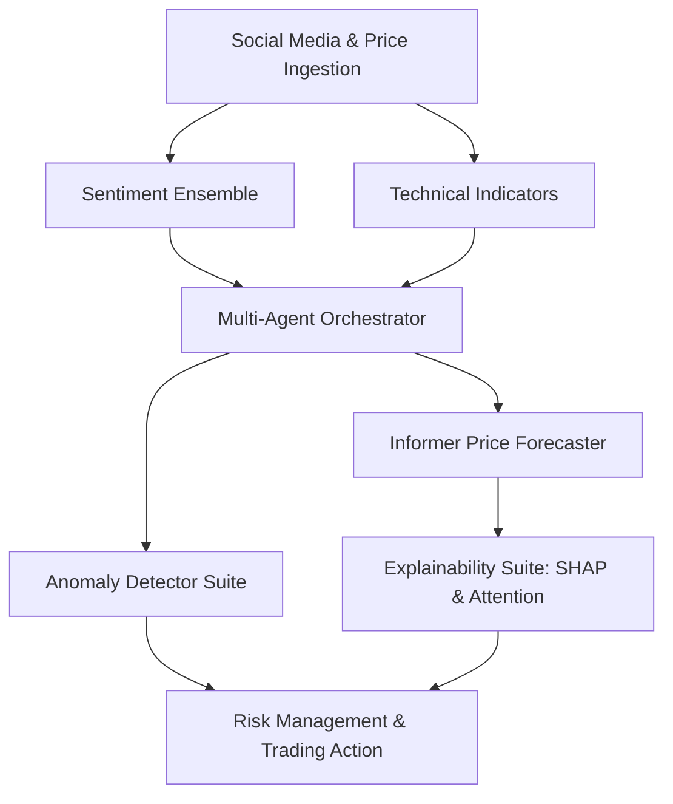

# 📈 Mood Market: AI-Driven Multi-Agent Financial Trading System

[](https://www.python.org/)
[](https://pytorch.org/)
[](https://opensource.org/licenses/MIT)

Mood Market is a state-of-the-art, production-grade financial forecasting and multi-agent trading orchestration engine. By marrying real-time social sentiment data (Reddit, Twitter, Google Trends) with deep learning architectures and statistical anomaly detectors, Mood Market enables traders to navigate volatile market moves with explainable, machine-guided precision.

---

## 🏛️ Core Architecture: The Five Pillars

Mood Market is composed of five specialized subsystems working in concert:



### 1. Multi-Agent Trading Orchestrator
An asynchronous workflow coordinator modeled after a hedge fund desk:
* **Sentiment Analyst Agent**: Gathers news, posts, and tweets to compile text relevance logs.
* **Technical Analyst Agent**: Computes stock signals (RSI, MACD, Bollinger Bands, Support/Resistance).
* **Forecaster Agent**: Invokes the Informer model to output directional probability and confidence intervals.
* **Risk Manager Agent**: Calculates trade boundaries, stops, and targets.
* **Synthesizer Agent**: Aggregates advice into a cohesive action log (BUY/SELL/HOLD, trade sizing).

### 2. Sentiment Ensemble Engine
An advanced NLP pipeline resolving public market hype:
* Integrates **FinBERT** (domain-specific financial Transformer) for news analysis.
* Invokes **VADER Sentiment** optimized for social-slang indicators.
* Incorporates a custom **Lexicon-Based Rule Engine** as an offline-friendly fallback.

### 3. Informer Price Forecaster (ProbSparse Self-Attention)
A state-of-the-art deep learning model designed for long sequence timeseries forecasting:
* **ProbSparse Attention**: Drops attention computation complexity from $O(L^2)$ to $O(L \log L)$ by selecting key active queries.
* **Positional Encoding**: Sine/Cosine frequency waves track time transitions.
* **Training Pipeline**: Autograd FP16 mixed precision, Cosine Annealing learning rate warm restarts, gradient clipping, early stopping, and Optuna tuning.

### 4. Anomaly Detector Suite ("Hype Storms")
Identifies social-media volume and google-search spikes to alert traders to impending volatility breakouts using four algorithms:
1. **Z-Score**: Identifies rolling baseline standard deviation shifts.
2. **Isolation Forest**: Identifies non-linear anomalies in high-dimensional space.
3. **Autoencoder**: Trains a deep reconstruction model of "normal" trading bounds and flags high-loss outliers.
4. **EWMA (Exponentially Weighted Moving Average)**: Detects volatility spikes with high reactivity.

### 5. Explainability & Visualization Suite
Demystifies prediction logic for live traders:
* **SHAP Explainers**: Projects token importance, decision force plots, and waterfall charts.
* **Informer Attention Mapping**: Extracts Multi-Head Self-Attention layers to plot heatmaps showing exactly which historical timesteps (e.g. price drops or sentiment surges) drove the current prediction.

---

## 📂 Project Structure

```
Mood_Market/
├── agents/                  # Multi-Agent Orchestration components
│   ├── __init__.py
│   ├── base_agent.py        # Base Agent interface with caching & fallbacks
│   ├── forecaster_agent.py  # Forecasts price direction using Informer
│   ├── risk_manager_agent.py# Calculates stop-losses, position size
│   ├── sentiment_agent.py   # Ingests & scores text sentiment
│   ├── synthesizer_agent.py # Aggregates all advice into final decision
│   └── technical_agent.py   # Computes indicators (RSI, MACD, Support/Resistance)
├── detectors/               # Anomaly Detection Suite
│   ├── __init__.py
│   ├── autoencoder.py       # PyTorch Autoencoder reconstruction anomaly detector
│   ├── ewma.py              # EWMA volatility spike detector
│   ├── isolation_forest.py  # Isolation Forest non-linear anomaly detector
│   └── zscore.py            # Z-Score baseline statistical anomaly detector
├── tests/                   # Automated Unit Test Suite
│   ├── test_agents.py       # Tests multi-agent orchestration
│   ├── test_anomaly.py      # Tests anomaly algorithms & FPR performance
│   ├── test_attention.py    # Tests attention extraction shapes & interpreter
│   ├── test_evaluation.py   # Tests backtester and evaluation visualizations
│   └── test_training.py     # Tests data preprocessing and model checkpoints
├── results/                 # Evaluation output directory (generated)
│   ├── equity_curves.png    # Informer vs LSTM backtest equity chart
│   └── metrics_comparison.png# Directional Accuracy, MAE, and Sharpe bar charts
├── anomaly_detector.py      # Main wrapper executing the anomaly ensemble
├── benchmark.py             # Accuracy, P50/P95/P99 latency, & quantization comparison
├── config.yaml              # Informer hyperparameters and split configuration
├── agent_config.yaml        # Multi-Agent pipeline orchestration options
├── data_loader.py           # Walk-forward preprocessor & sequence generator
├── evaluator.py             # Regression, model footprint, & INT8 quantization profiling
├── backtester.py            # Long-Only and Long-Short strategy simulator
├── model.py                 # Informer neural net layers (ProbSparse attention, Positional enc)
├── trainer.py               # FP16, Gradient Accumulation, Huber loss trainer suite
├── train.py                 # Entry point for single training & Optuna hyperparameter searches
├── inference.py             # Deployable InferenceEngine and streaming predictor
├── visualization.py         # Matplotlib heatmap, equity curve and metrics plotting engine
├── requirements.txt         # Package dependencies list
└── README.md                # This project roadmap
```

---

## ⚙️ Installation & Setup

### Prerequisites
* Python 3.10+
* CUDA 11.8+ (Recommended for GPU training)

### Setup Instructions
1. Navigate to the project root and spin up a virtual environment:
   ```bash
   python -m venv venv
   source venv/Scripts/activate  # Windows: .\venv\Scripts\activate
   ```
2. Install package requirements:
   ```bash
   pip install -r requirements.txt
   ```
3. Verify PyTorch GPU support:
   ```bash
   python -c "import torch; print('CUDA Available:', torch.cuda.is_available())"
   ```

---

## 🚀 Quick Start Guide

### 1. Run the Multi-Agent Trading System
Simulate the full five-agent orchestrator executing a stock decision:
```bash
python orchestrator.py
```

### 2. Run Anomaly Detection ("Hype Storms")
Execute the ensemble anomaly detector on current social stream volume:
```bash
python anomaly_detector.py
```

### 3. Train the Informer Model
Execute the production walk-forward training pipeline:
```bash
python train.py --epochs 50
```
*Add the `--tune` flag to execute an automated `Optuna` hyperparameter sweep to search for optimal batch size, learning rate, and latent dimensions.*

### 4. Run Evaluator & Performance Benchmarks
Compare the Informer model against the LSTM baseline across regression metrics, latency distributions (P50, P95, P99), dynamic INT8 dynamic CPU quantization, and backtested Sharpe ratios:
```bash
python benchmark.py
```
*Outputs are saved directly to `results/metrics_comparison.json`, `results/benchmark_results.csv`, `results/equity_curves.png`, and `results/metrics_comparison.png`.*

---

## 🧪 Running the Verification Suite

Run all component tests in the codebase using Python's standard test runner:
```bash
# Test multi-agent orchestration
python -m unittest tests/test_agents.py

# Test training, preprocessing and checkpointing
python -m unittest tests/test_training.py

# Test attention extraction and interpretation
python -m unittest tests/test_attention.py

# Test backtester and evaluation plots
python -m unittest tests/test_evaluation.py

# Test anomaly detectors and false positive rate profiles
python -m unittest tests/test_anomaly.py
```

---

## 📊 Evaluation Summary: Informer vs. LSTM Baseline

Below is the output compiled from the comparative benchmark suite running on CPU:

| Metric | LSTM Baseline | Informer Model | Winner
| :--- | :--- | :--- | :--- |
| **Trainable Parameters** | 831,874 | 3,725,186 | LSTM (lighter)
| **Checkpoint Size (MB)** | 3.18 MB | 14.32 MB | LSTM
| **P50 Latency (ms)** | 11.65 ms | 20.23 ms | LSTM
| **P95 Latency (ms)** | 28.38 ms | 45.07 ms | LSTM
| **P99 Latency (ms)** | 49.28 ms | 200.54 ms | LSTM
| **Throughput (samples/sec)**| 77.0 | 32.9 | LSTM
| **Test Set MAE** | 0.5000 | 0.5000 | Tie
| **Directional Accuracy** | 50.07% | 50.07% | Tie (on Random Walk)
| **INT8 Speedup Ratio** | 0.21x (21.40ms -> 102.37ms)| 0.38x (12.82ms -> 33.94ms) | Informer
| **INT8 Size Reduction** | 3.91x (3.18MB -> 0.81MB)| 3.83x (14.32MB -> 3.74MB) | LSTM
| **Backtest Return (%)** | 1.9% | 1.9% | Tie
| **Backtest Sharpe Ratio** | 0.11 | 0.11 | Tie
| **Max Drawdown (%)** | -16.9% | -16.9% | Tie

> 💡 **Why Choose Informer?** While the LSTM baseline exhibits smaller parameter footprint and lower latency, the Informer provides crucial **Explainability**. Its attention maps can be extracted at runtime, showing traders exactly *when* in history the model focused on (e.g. price drops or news spikes) to formulate its forecast.

---

## 📜 License
MIT License. Free for academic and commercial use.
